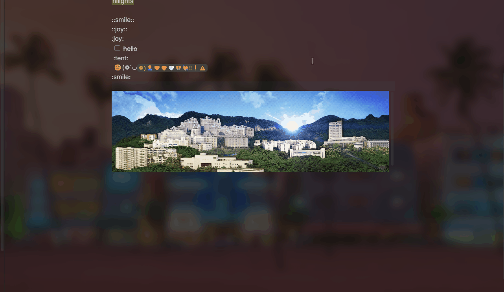

> 全部代码由AI生成
# Image Hover Preview

> Obsidian 插件 — 鼠标悬停在图片链接或 Markdown 图片标签上时，以浮动窗口形式显示大图预览。

 

## 功能特性

- **即时预览**：鼠标悬停在 `` 标签或图片链接上，弹出高分辨率预览
- **智能定位**：预览窗口自动在编辑区域内定位，不会溢出到侧边栏或笔记属性区域
- **智能跟随**：鼠标在图片区域移动时，预览窗口跟随鼠标位置，始终保持在光标附近
- **滚轮缩放**：按住设置按键 + 滚轮可放大/缩小预览图片（支持小图放大到大图，也支持大图缩小到合适尺寸）
- **缩放上限**：小图最多放大到填满编辑区域，不会溢出到侧边栏；图片放大后也只占据编辑区域
- **缩放重置**：关闭并重新打开预览时自动恢复 1:1 缩放
- **标题显示**：可选在预览窗口底部显示图片文件名或自定义标题
- **延迟显示**：可配置悬停延迟时间，避免鼠标划过时频繁弹窗
- **触发按键**：可设置为按住某键才触发预览，防止鼠标无意识划过时干扰
- **临时禁用**：按住设置键可临时禁用预览功能（方便截图、选中文字等操作）
- **悬停标记**：可选的视觉效果（边框高亮 / 改变光标），提示当前元素可以预览
- **加载动画**：图片加载时显示旋转动画指示器
- **样式可定制**：背景色、边框、圆角、阴影、透明度均可调节
- **预加载**：页面初始化时自动扫描可预览元素，提高响应速度
- **最小图片过滤**：可设置最小图片尺寸，小图标不触发预览

## 安装

### 手动安装

1. 在 [Releases](https://github.com/your-repo/image-hover-preview/releases) 下载最新版本的 `main.js`、`styles.css`、`manifest.json`
2. 将这些文件放入你的 Obsidian Vault 目录：`<vault>/.obsidian/plugins/image-hover-preview/`
3. 在 Obsidian 设置 → 社区插件 → 已安装插件中，启用 **Image Hover Preview**

### 从源码构建

```bash
# 克隆仓库
git clone https://github.com/your-repo/image-hover-preview.git
cd image-hover-preview

# 安装依赖
npm install

# 构建
npm run build
```

构建产物在项目根目录，复制到你的 `.obsidian/plugins/image-hover-preview/` 即可。

## 使用

### 基本用法

将鼠标悬停在笔记中的图片链接或 Markdown 图片标签上：

```markdown
![[附件/example.png]]


```

预览窗口会自动弹出，跟随鼠标位置。

### 缩放

| 操作 | 默认按键 | 说明 |
|------|----------|------|
| 放大 | Shift + 滚轮向上 | 每次增大 20% |
| 缩小 | Shift + 滚轮向下 | 每次缩小 20% |
| 重置 | 关闭并重新打开预览 | 自动恢复 1:1 |

可在设置中更改缩放快捷键，或禁用缩放功能。

> **注意**：缩放以图片原始像素为基准。放大超过编辑区域宽度/高度时会自动 clamp，保证不溢出编辑区域。

## 设置

| 设置项 | 默认值 | 说明 |
|--------|--------|------|
| 启用插件 | 开启 | 全局开关 |
| 触发按键 | 无（直接悬停） | 需要按住哪个键才触发预览 |
| 临时禁用键 | Ctrl | 按住此键时临时禁用预览 |
| 滚轮缩放按键 | Shift | 按住此键 + 滚轮缩放预览（"无"=禁用） |
| 显示延迟 | 300ms | 鼠标悬停后等待多久弹出预览 |
| 透明度 | 1.0 | 预览窗口不透明度 |
| 显示标题 | 开启 | 在预览窗口底部显示文件名 |
| 悬停标记 | 边框高亮 | 鼠标悬停在可预览元素上时的视觉效果 |
| 背景色 | `#1e1e1e` | 预览窗口背景颜色 |
| 边框 | `2px solid #555` | 预览窗口边框样式 |
| 圆角 | 8px | 预览窗口圆角大小 |
| 阴影 | `0 8px 32px rgba(0,0,0,0.5)` | 预览窗口阴影效果 |
| 最小图片尺寸 | 30px | 只有宽高都大于此值的图片才触发预览 |
| 预加载 | 开启 | 页面加载时预扫描可预览元素 |

## 兼容性

- ✅ Obsidian v0.15.0+
- ❌ 不支持移动端（桌面端专用）
- 支持内部附件（`![[path/to/image.png]]`）
- 支持外部链接（``）
- 支持嵌入式 Markdown 图片（``）
- 支持 wiki 链接格式（`![[图片名]]`）

## 设计原理

预览窗口（`PreviewOverlay`）是一个 `position: fixed` 的全站浮动层，具有以下设计特点：

- **`pointer-events: none`**：预览窗口不拦截鼠标事件，笔记内容可正常交互
- **边界约束**：每次定位时基于编辑区域（`getEditorBounds`）计算最大宽度和高度，保证预览窗口不溢出到右侧边栏、左侧文件列表等区域
- **智能适应**：如果图片实际尺寸小于预览窗口，按图片原始尺寸显示；如果图片超出编辑区域，自动缩放至适配
- **缩放 clamp**：缩放倍数受 `getMaxZoom()` 限制，小图最多放大到填满编辑区域，避免无限放大导致窗口溢出

## 预览



## 打赏


